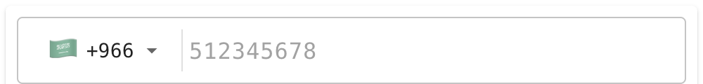
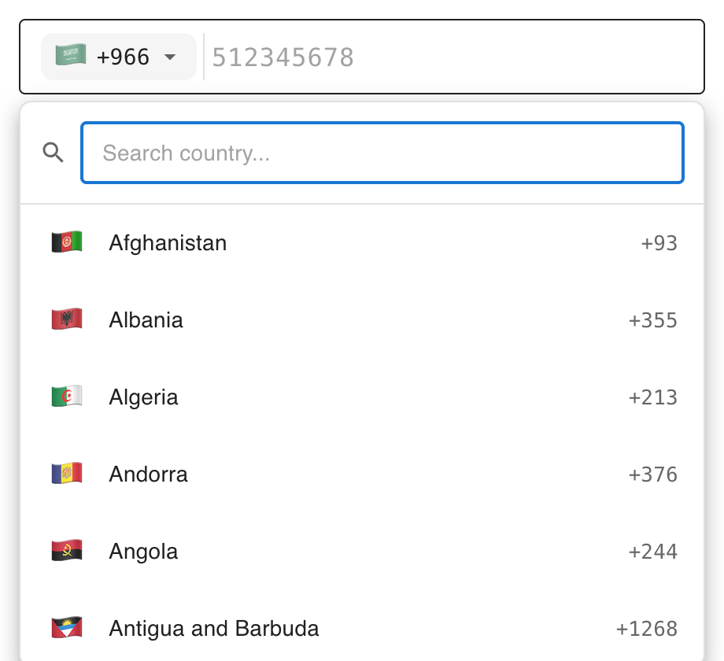
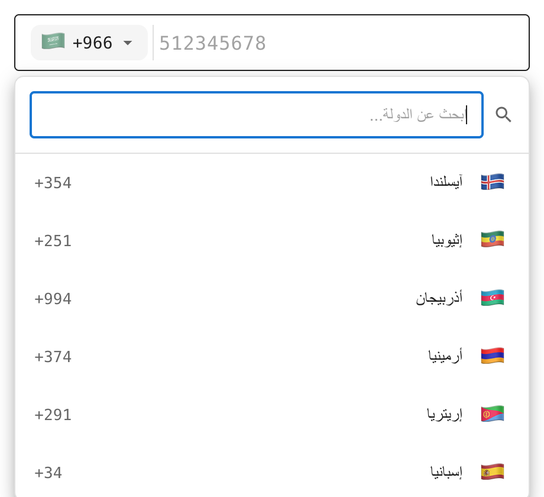
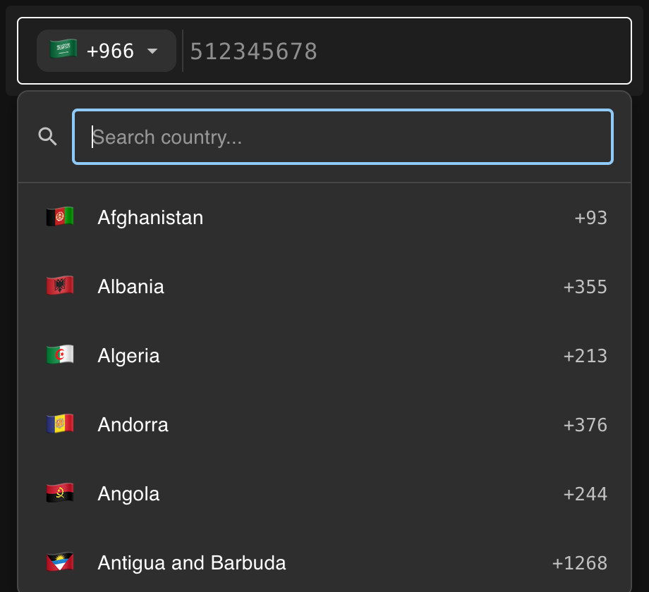
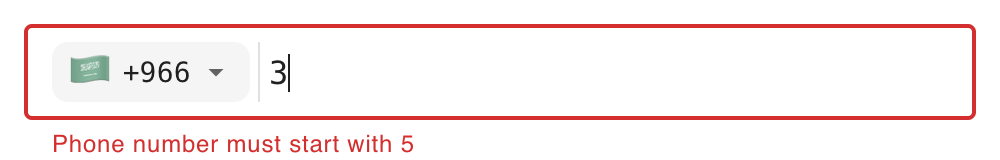

# @mapatak/phone-input

Production-grade internationalized phone number input component for React. Supports **196 countries** with E.164 validation, searchable country dropdown, RTL support, and dark mode.



---

## Preview

| English (LTR) | Arabic (RTL) |
|:-:|:-:|
|  |  |

| Dark Mode | Validation |
|:-:|:-:|
|  |  |

---

## Features

- **196 Countries** - Full coverage with flag emojis, dial codes, and regex validation patterns
- **E.164 Output** - Ready for WhatsApp, Twilio, SMS gateways
- **Smart Validation** - Prefix-first error feedback (wrong digit detected immediately)
- **Country-Specific Examples** - Dynamic placeholder per country (e.g. SA: `512345678`, US: `2012345678`)
- **RTL Support** - Arabic and Urdu with proper right-to-left dropdown layout
- **Dark Mode** - Full MUI theme integration
- **Searchable Dropdown** - Search by country name, ISO code, or dial code
- **4 Locales** - English, Arabic, Spanish, Urdu
- **React Hook Form** - Built-in hook for form integration
- **Zod Schemas** - Server-side validation helpers
- **TypeScript** - Full type safety with exported declarations
- **Zero External Phone Libraries** - 100% custom built on MUI

---

## Installation

```bash
npm install git+ssh://git@github.com:amr453/MapatakPhoneInput.git
```

### Peer Dependencies

```bash
npm install react react-dom @mui/material @mui/icons-material @emotion/react @emotion/styled zod react-hook-form
```

---

## Quick Start

### Basic Usage

```tsx
import { MapatakPhoneInput } from "@mapatak/phone-input";
import type { PhonePayload } from "@mapatak/phone-input";

function App() {
  const handleChange = (payload: PhonePayload | null) => {
    if (payload) {
      console.log(payload.fullWithPlus);    // "+966512345678"
      console.log(payload.nationalNumber);  // "512345678"
      console.log(payload.countryCode);     // "SA"
    }
  };

  return (
    <MapatakPhoneInput
      defaultCountryIso="SA"
      locale="en"
      onChange={handleChange}
      required
    />
  );
}
```

### With React Hook Form

```tsx
import { MapatakPhoneInput, usePhoneField } from "@mapatak/phone-input";
import { useForm } from "react-hook-form";

function PhoneForm() {
  const { control, handleSubmit } = useForm();
  const phoneField = usePhoneField(control, "phone", true);

  return (
    <form onSubmit={handleSubmit(console.log)}>
      <MapatakPhoneInput
        {...phoneField}
        defaultCountryIso="SA"
        locale="ar"
      />
      <button type="submit">Submit</button>
    </form>
  );
}
```

---

## Props

| Prop | Type | Default | Description |
|------|------|---------|-------------|
| `defaultCountryIso` | `string` | `"SA"` | Default country ISO code |
| `value` | `string` | `""` | Controlled phone number value |
| `onChange` | `(payload: PhonePayload \| null) => void` | - | Called with validated payload or null |
| `onValidationChange` | `(isValid: boolean) => void` | - | Called when validation state changes |
| `error` | `boolean` | `false` | Show error state |
| `helperText` | `string` | `""` | Custom helper/error text |
| `disabled` | `boolean` | `false` | Disable input |
| `locale` | `"en" \| "ar" \| "es" \| "ur"` | `"en"` | UI language |
| `size` | `"small" \| "medium"` | `"medium"` | Input size |
| `fullWidth` | `boolean` | `true` | Full width input |
| `label` | `string` | - | Optional label text |
| `placeholder` | `string` | Country example | Custom placeholder (overrides dynamic example) |
| `required` | `boolean` | `false` | Required field |

---

## Output Format

```typescript
interface PhonePayload {
  fullWithPlus: string;       // "+966512345678" (E.164)
  fullWithoutPlus: string;    // "966512345678"
  nationalNumber: string;     // "512345678"
  countryCode: string;        // "SA" (ISO 3166-1 alpha-2)
  dialCode: string;           // "966"
}
```

---

## Validation

Errors are prioritized for the best user experience:

| Priority | Error | When | Example |
|----------|-------|------|---------|
| 1 | **Invalid prefix** | First digit is wrong | SA: typed `3` instead of `5` |
| 2 | **Too short** | Correct prefix, not enough digits | SA: typed `512` (need 9) |
| 3 | **Too long** | Exceeded max digits | SA: typed 10+ digits |
| 4 | **Invalid format** | Full regex mismatch | Final pattern check |

Each country has a unique regex pattern, min/max length, and valid starting digits.

---

## Localization

| Language | Code | Direction | Countries | Errors |
|----------|------|-----------|-----------|--------|
| English | `en` | LTR | 196 | 5 |
| Arabic | `ar` | RTL | 196 | 5 |
| Spanish | `es` | LTR | 196 | 5 |
| Urdu | `ur` | RTL | 196 | 5 |

---

## Country Coverage

| Region | Countries |
|--------|-----------|
| Africa | 54 |
| Asia | 48 |
| Europe | 45 |
| Americas | 35 |
| Oceania | 14 |
| **Total** | **196** |

---

## Exports

```typescript
// Component
import { MapatakPhoneInput } from "@mapatak/phone-input";

// Types
import type { MapatakPhoneInputProps, PhonePayload, CountryConfig } from "@mapatak/phone-input";

// Hook
import { usePhoneField } from "@mapatak/phone-input";

// Utilities
import {
  COUNTRIES_CONFIG,
  getCountryByIso,
  getCountryByDialCode,
  getDefaultCountry,
  validatePhone,
  validateAndBuildPayload,
  createPhoneSchemaForCountry,
  phonePayloadSchema,
} from "@mapatak/phone-input";
```

---

## Tech Stack

| Technology | Version | Role |
|------------|---------|------|
| React | 18+ | UI Framework |
| TypeScript | 5.x | Type Safety |
| MUI | v6.x | UI Components |
| Zod | 3.x | Schema Validation |
| React Hook Form | 7.x | Form Integration |

---

## Build

```bash
npm run build        # Compile TypeScript to dist/
npm run dev          # Start demo app (Vite)
npm run typecheck    # Type check without emit
```

---

## License

UNLICENSED - Proprietary software. All rights reserved.
